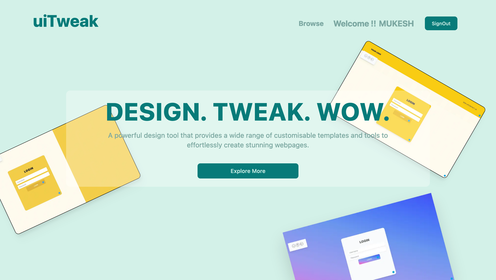
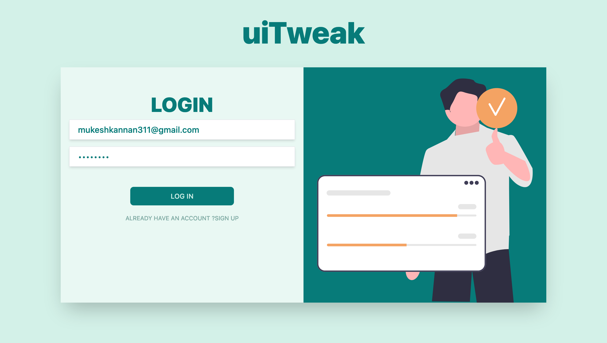
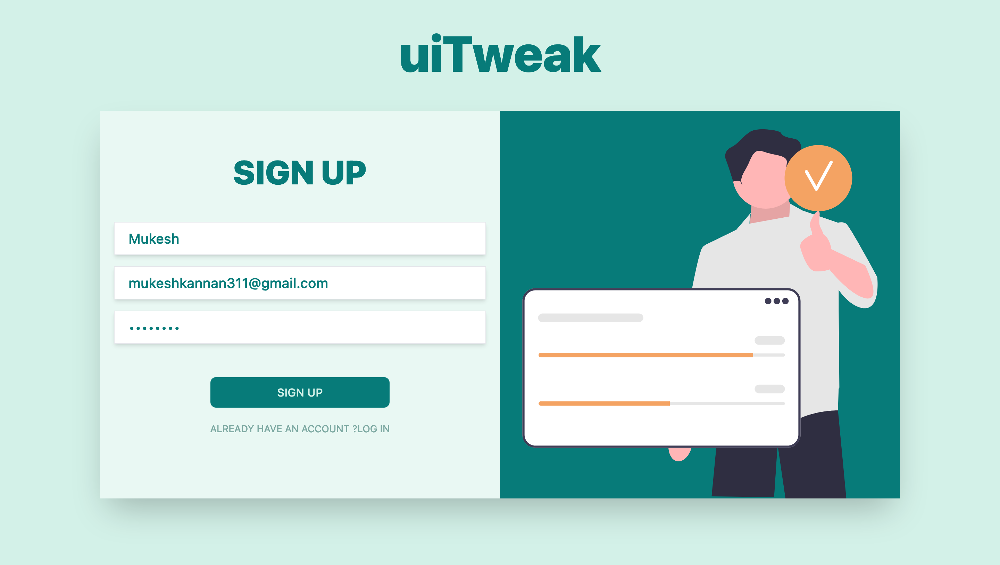

<!-- PROJECT LOGO -->
 

  <h2 align="center">uiTweak</h2>
  

    A WebApp to visualize your webpage
  

     

<!-- TABLE OF CONTENTS -->

  
Table of Contents

  <ol>
    <li><a href="#screenshot-of-the-project">Working Sample</a></li>
    <li>
      <a href="#about-the-project">About The Project</a>
      <ul>
        <li><a href="#built-with">Built With</a></li>
      </ul>
    </li>
    <li>
      <a href="#getting-started">Getting Started</a>
      <ul>
        <li><a href="#prerequisites">Prerequisites</a></li>
        <li><a href="#installation">Installation</a></li>
      </ul>
    </li>
    <li><a href="#usage">Usage</a></li>
    <li><a href="#contact">Contact</a></li>
  </ol>

<!-- SCREENSHOTs -->
## Screenshot of the project

<h3>Working Sample</h3>

<!-- ABOUT THE PROJECT -->
## About The Project
With this WebApp users can browse through various layouts provdied for pages like Login, Contact etc., They can select any template and
manipulate different parts/section of the template, users can alter default color, height/width of a section, or they can also add their custom
CSS styling which gives them further more freedom. They can play with the default template till they find the combination they envisioned.

Users can also create a account that allows them to store their templates and look back or tweak later.

(<a href="#readme-top">back to top</a>)

### Built With
I used the following frameworks/tools to build this project:

* [![React][React]][React-url]
* [![Next13][Next13]][Next13-url]
* [![Redux-Toolkit][Redux-Toolkit]][Redux-Toolkit-url]
* [![Tailwind][Tailwindcss]][Tailwindcss-url]
* [![Prisma][Prisma]][Prisma-url]
* [![NextAuth][NextAuth]][NextAuth-url]
* [![Supabase][Supabase]][Supabase-url]

(<a href="#readme-top">back to top</a>)

<!-- GETTING STARTED -->
## Getting Started
Instruction to clone this reporsitory and setting it locally on your machine.

### Prerequisites
 WILL BE UPDATED SOON . . . .
  

(<a href="#readme-top">back to top</a>)

<!-- USAGE EXAMPLES -->
## Usage

From Home page click Browse to view all the collection of templates available to you
Click on "Tweak" Button to manipulate the copy of the template.On clickin you will be
redirected to that template page. Use the color picker and slider on the left to manipulate the 
page. If you are signed in the save button will save the tweaked template to your profile.
You can edit/view the saved template from your profile page..

(<a href="#readme-top">back to top</a>)

<!-- CONTACT -->
## Contact

M K Mukesh Kannan - [@mukesh-kannan](https://www.linkedin.com/in/mukesh-kannan-mk/) - mukeshkannan311@gmail.com

Project Link: [TODO](https://github.com/MKMukeshkannan/todo-app)

(<a href="#readme-top">back to top</a>)

<!-- SCREENSHOTs -->
## Screenshot of the project

<h3>HOME PAGE</h3>

<h3>LOGIN PAGE</h3>

<h3>SIGNUP PAGE</h3>

(<a href="#readme-top">back to top</a>)

[React]: https://img.shields.io/badge/React-20232A?style=for-the-badge&logo=React&logoColor=#092E20
[React-url]: https://react.dev/
[Next13]: https://img.shields.io/badge/nextdotjs-20232A?style=for-the-badge&logo=nextdotjs&logoColor=#092E20
[Next13-url]: https://nextjs.org/
[NextAuth]: https://img.shields.io/badge/NextAuth-20232A?style=for-the-badge&logo=nextdotjs&logoColor=#092E20
[NextAuth-url]: https://nextjs.org/
[Redux-Toolkit]: https://img.shields.io/badge/redux-20232A?style=for-the-badge&logo=redux&logoColor=#092E20
[Redux-Toolkit-url]: redux-toolkit.js.org
[Tailwindcss]: https://img.shields.io/badge/Tailwind-35495E?style=for-the-badge&logo=tailwindcss&logoColor=#06B6D4
[Tailwindcss-url]: https://tailwindcss.com/
[supabase]: https://img.shields.io/badge/supabase-E4637C?style=for-the-badge&logo=supabase&logoColor=#003B57
[supabase-url]:https://supabase.com/
[prisma]: https://img.shields.io/badge/prisma-E4637C?style=for-the-badge&logo=prisma&logoColor=#003B57
[prisma-url]:https://prisma.io/
